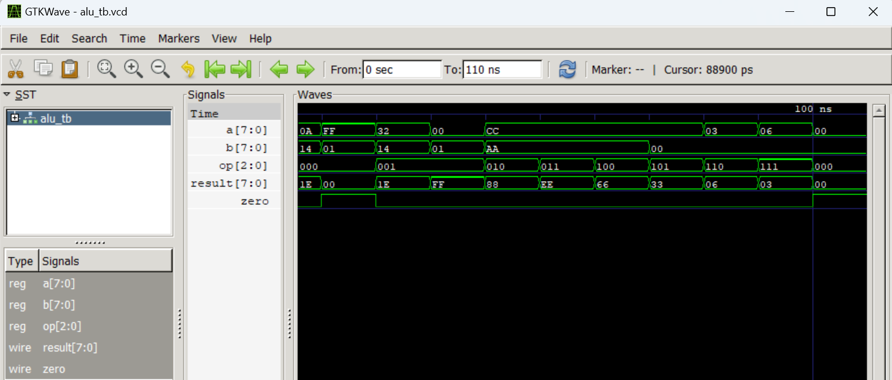

# Projet Title /Titre du projet 
 ALU (Arithmetical and logical unit ) 8 bits
## Description (EN)
This project is the first in a long series, in the field of IC design, this project is an 8-bit ALU, in other words an 8-bit arithmetic and logic unit, the ALU is the computing center, it performs arithmetic and logical operations.
## Description (FR)
Ce projet est le premier d une longue série, dans le domaine de l'ic design , ce projet est un ALU de 8bits autrement dit une unité arithmetique et logique de 8 bits , l alu c est le centre de calcul, il fait des operations arithmetique et logique.
## Supported Operations / Opérations supportées
| Opcode | Operation | Description |
|--------|-----------|-------------|
| 000 | ADD | Addition |
| 001 | SUB | Soustraction |
| 110 | SHL | Shift left — multiplication par 2 |
| 111 | SHR | Shift right — division par 2 |
| 010 | AND | AND bit à bit |
| 011 | OR  | OR bit à bit |
| 100 | XOR | XOR bit à bit |
| 101 | NOT | NOT bit à bit |

## Project Structure / Structure du projet


## How to simulate / Comment simuler
**Compilation :**
```bash
iverilog -g2012 -o alu_tb src/alu.sv tb/alu_tb.sv
```
**Simulation :**
```bash
vvp alu_tb
```

## Waveform / Formes d'onde


## Author / Auteur
LIADI Ramadan Atanda